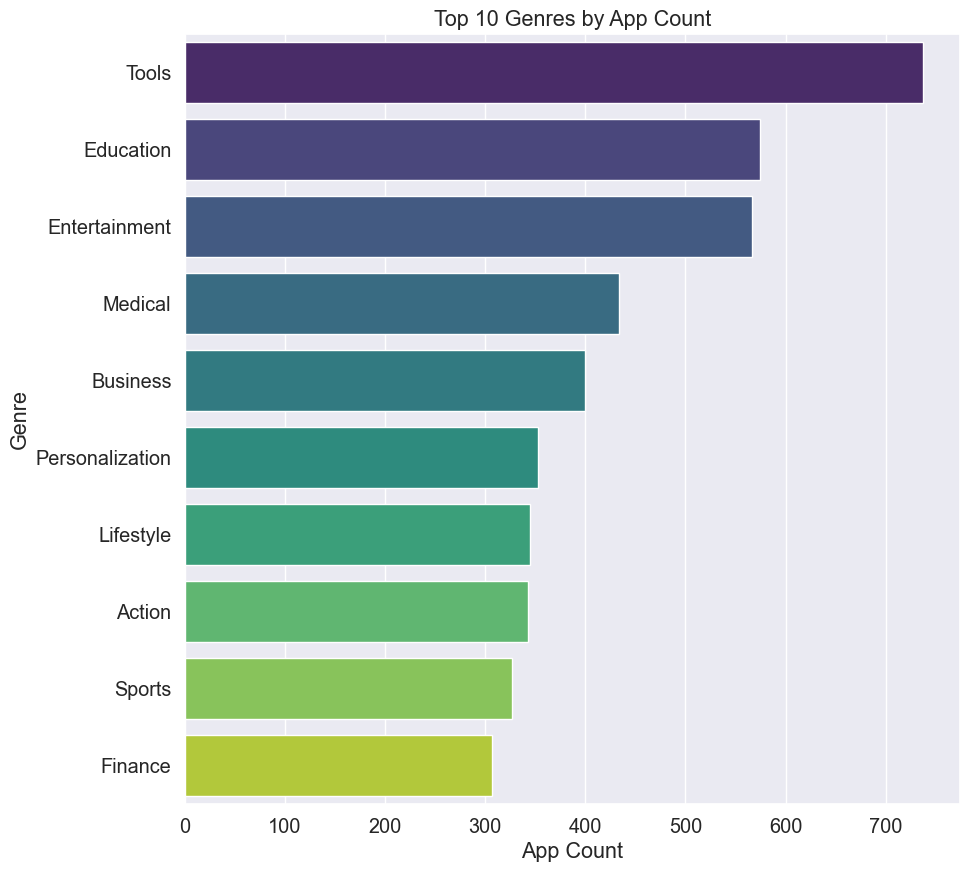

# Play Store Apps Data Cleaning & Analysis 📱

## Introduction⭐
The Play Store hosts a wide range of applications, and the data associated with these apps offers significant potential for analysis. Developers and businesses can leverage this data to understand market trends, optimize their apps, and maximize user engagement.

In this project, we perform data cleaning and preprocessing on the Play Store apps dataset. Our focus is to address missing values, handle outliers, and fix data inconsistencies, all while extracting valuable insights to better understand the app market.

---

## Tasks Completed 🛠️

### Data Cleaning 🧹
- **Fix Rating**: Corrected inaccurate or missing ratings.
- **Fix Size**: Handled issues with missing or incorrect app size data.
- **Fix Price**: Cleaned pricing information for accuracy.
- **Fix Category**: Corrected misclassified app categories.
- **Fix Android Version**: Ensured consistency in Android version data.
- **Handle Missing Values**: Identified and filled missing values appropriately.
- **Outlier Detection and Handling**: Detected and addressed outliers in various columns.
- **General Fixing**: Fixed any other inconsistencies found within the dataset.

---

## Key Insights & Analysis 🔍

- **Most Expensive App** 💸: Analyzed and identified the most expensive app on the Play Store.
- **Top Genres** 🎮: Determined which genre has the highest number of apps.
- **Free vs. Paid Apps** 💵: Analyzed the average size of free vs. paid apps.
- **Top 5 Most Expensive Apps with a Perfect Rating (5)** 🌟: Identified the top 5 most expensive apps with a perfect rating.
- **Apps with >50K Reviews** 📈: Found the number of apps with over 50,000 reviews.
- **Average Price by Genre & Installs** 💲: Calculated the average price of apps, grouped by genre and number of installs.
- **Apps with Ratings >4.7** ⭐: Analyzed apps with ratings higher than 4.7 and their average price.
- **Google’s Estimated Revenue from Popular Apps** 💰: Estimated Google’s revenue from apps with 5 million+ installs (assuming a 30% cut from sales).
- **Size of Free vs. Paid Apps** 📏: Investigated the maximum and minimum sizes of free vs. paid apps.
- **Correlation Analysis** 🔗: Examined correlations between app ratings, number of reviews, size, and price.
- **Free/Paid Apps by Content Rating** 📱: Analyzed the distribution of apps by type (free/paid) across different content ratings.
- **Compatibility with Android Version 4.x** 📱: Determined how many apps are compatible with Android version 4.x.

---
## Example Chart 📊

Here is an example chart showing the top 10 apps:

---

## Technologies Used ⚙️
- **Pandas**: For data cleaning and preprocessing.📊
- **Matplotlib**: For data visualization.📉
- **NumPy**: For numerical operations.

